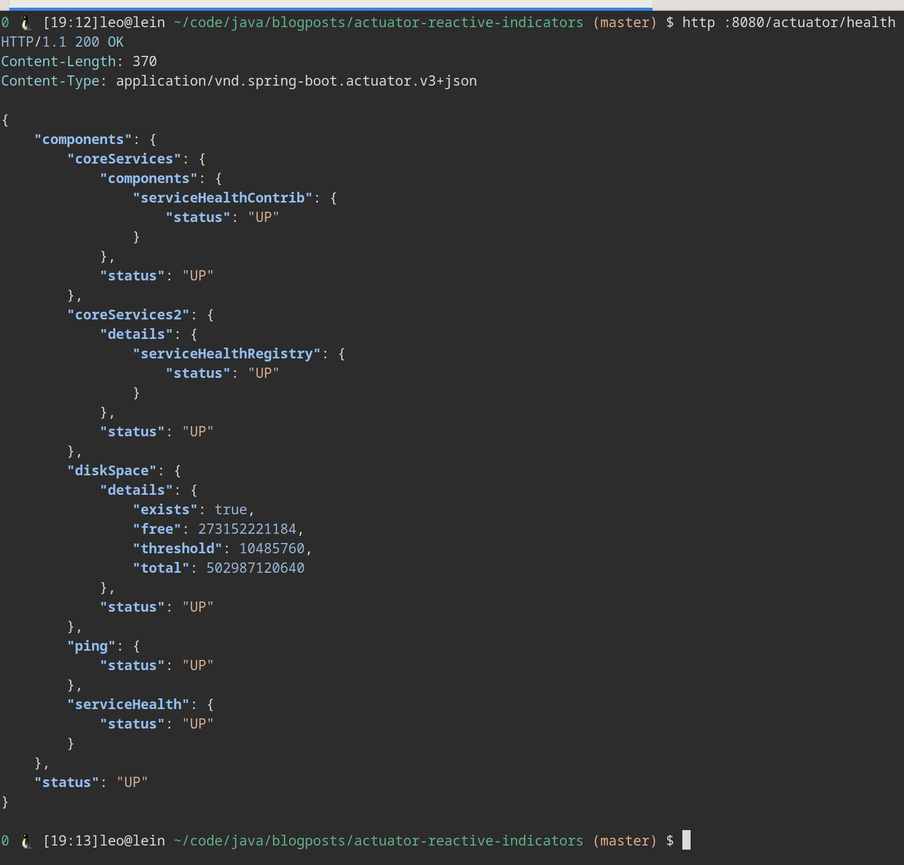

# actuator-reactive-indicators
Simple Spring Boot project showing how to use Reactive Actuator Health Indicators

## Build
```bash
mvn package
```

## Run
```bash
java -jar target/health-indicators-0.0.1-SNAPSHOT.jar
```

## Viewing the health indicators:

```
$ http :8080/actuator/health
HTTP/1.1 200 OK
Content-Length: 370
Content-Type: application/vnd.spring-boot.actuator.v3+json

{
    "components": {
        "coreServices": {
            "components": {
                "serviceHealthContrib": {
                    "status": "UP"
                }
            },
            "status": "UP"
        },
        "coreServices2": {
            "details": {
                "serviceHealthRegistry": {
                    "status": "UP"
                }
            },
            "status": "UP"
        },
        "diskSpace": {
            "details": {
                "exists": true,
                "free": 273152212992,
                "threshold": 10485760,
                "total": 502987120640
            },
            "status": "UP"
        },
        "ping": {
            "status": "UP"
        },
        "serviceHealth": {
            "status": "UP"
        }
    },
    "status": "UP"
}

```



